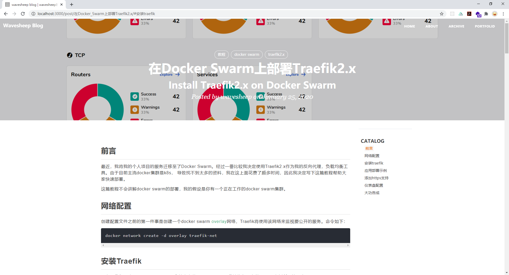

wavesheep-blog-engine
================================

[Live Demo](https://blog.wavesheep.net)

## 是什么？

wavesheep-blog-engine 是我个人博客的生成系统，它只能生成我预设主题的博客，而非如Hexo这样的项目。

这个项目的样式设计并非原创，很大程度上是在我个人很喜欢博客项目[huxpro.github.io](https://github.com/Huxpro/huxpro.github.io)上进行调整的。



项目当前并没有引入很多插件，仅提供了mathjax数学公式和emoji支持，如果有其它需求你可以fork这个项目自由添加。

## 怎么用？

### data文件夹

data文件夹是放置博客数据文件夹，是驱动这个项目工作的**核心**。它的位置必须位于本项目的**根目录**。

data文件夹的数据在工作时会被映射到网站的根目录（通过复制到static目录实现),  因此你可以在此放置*favico.ico*,

*robots.txt*, 等需要放置在根目录的文件。data文件夹下的内容可以资源编辑，**除了img和post文件夹**

> `/img/<图片文件>` 是本项目图片加载的指定路径。` /post/<博文markdown文件>`是本项目博文加载的指定路径。

除了这些静态资源外，data文件夹下还必须有`blog.config.js`这个文件，这是项目的配置文件，其结构如下

```js
export default {
  owner: '作者名，显示在页脚版权声明处',
  beian: {
    icp: 'icp号，可选',
    gongan: { // 公安网备，可选
      name: '',
      code: ''
    }
  },
  title: '网页标题',
  keywords: '你的网站关键字，用于SEO',
  index: { // 主页配置
    title: 'Wavesheep Blog',
    description: '代码艺术生活...总之你能想到的这里都有',
    img: '/img/home-bg.jpg'
  },
  about: { // 个人介绍页配置
    title: 'About',
    description: 'Hi, I am wavesheep',
    img: '/img/home-bg.jpg'
  },
  archive: { // 历史博文标签页配置
    title: 'Archive',
    description: '我把我的全部都给你',
    img: '/img/tag-bg.jpg'
  },
  portfolid: { // 个人作品集页配置
    title: 'Portfolid',
    description: 'idea -> reality',
    img: '/img/home-bg.jpg'
  },
  error: { // 错误页配置
    description: '这里似乎是一切的尽头:(',
    img: '/img/error.jpg'
  },
  socialAccount: { // 社交账号，显示在页脚。目前支持github，wechat，linkedin，mail, qq, twitter, weibo, zhihu
    github: 'https://github.com/wavesheep',
    wechat: '/img/weixinqr.jpg'
  },
  analytics: {
    baidu: { // 百度统计配置
      enable: true,
      id: '843684005c74531449b7a78f30ef952c'
    },
    google: { // google analytics 配置
      enable: true,
      id: 'UA-135967588-2'
    }
  },
  vssue: { // 评论系统配置, 具体操作见https://vssue.js.org/zh/guide/github.html#%E5%88%9B%E5%BB%BA%E4%B8%80%E4%B8%AA%E6%96%B0%E7%9A%84-oauth-app
    owner: '',
    repo: '',
    clientId: '', 
    clientSecret: ''
  }
}

```

这个文件夹下两个特殊的文件`about.md`和`portfolid.md`分别用于构建about和portfolid页面。

需要说明的是你可以在markdown里添加html，并且你可以使用`tailwind-css`的工具类，但是我不能保证一定生效，很多项目没用到的工具类已经被purge掉了。

更直观的配置可以参考[这个demo](https://github.com/wavesheep/wavesheep-blog-demo)， demo去掉了vssue配置部分敏感信息。

## 本地生成

clone 项目到本地，将配好的data的文件夹放入根目录，运行以下命令

```shell
npm run build && npm run generate
```

运行完毕后会在根目录生成一个dist文件夹，里面就是生成的静态博客

使用以下命令运行博客

```shell
// 运行在localhost:3000
npm run dev:start
// 运行在 0.0.0.0::3000
npm run prod:start
```

## 使用docker

因为我个人是把项目部署到docker swarm上的，所以我也分享下我的配置文件以供参考

### 容器构建

```dockerfile
# resource
FROM alpine/git as resource

WORKDIR /data

RUN git clone https://github.com/wavesheep/wavesheep-blog-engine.git .
RUN git clone <你的博客github地址，请使用https方式，ssh方式会构建失败> data/

# runtime
FROM node:12.16.1 AS runtime

COPY --from=resource /data/ /data/

WORKDIR /data/

RUN npm i && npm run build && npm run generate

ENTRYPOINT npm start
```


License
-------

Apache License 2.0. Copyright (c) 2020-present wavesheep
